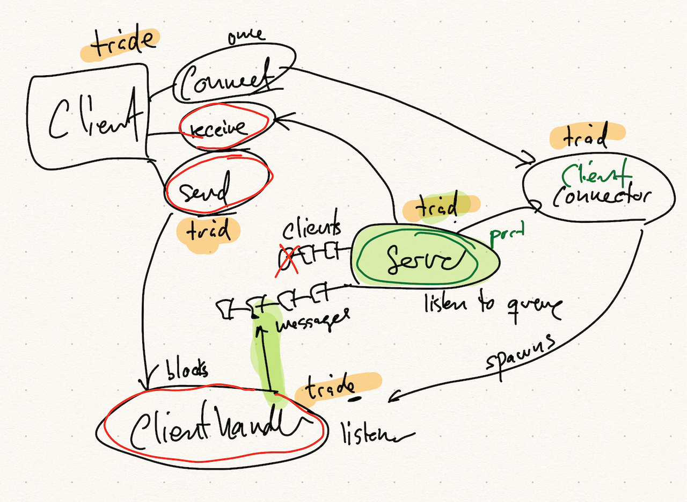

# Lille chat client/server demo på 2. semester

## Sådan startes server og client

1. Kør main

## Sådan starter du en ekstra client på din egen maskine

1. Kør main
2. Kør ExtraClient

## Sådan forbinder du en ekstra client til en server på en anden maskine

1. Find IP adressen på din maskine
2. Del den med en anden person
3. Kør ExtraClient med IP adressen

## Skitse over chatserver og chat client med diverse klasser og tråde

## Velkommen til, banan
(advarsel: komisk stort billede af én [banan](https://i.pinimg.com/originals/ac/8f/99/ac8f99b5754406e52d51342471177bd2.png) nedenfor)

